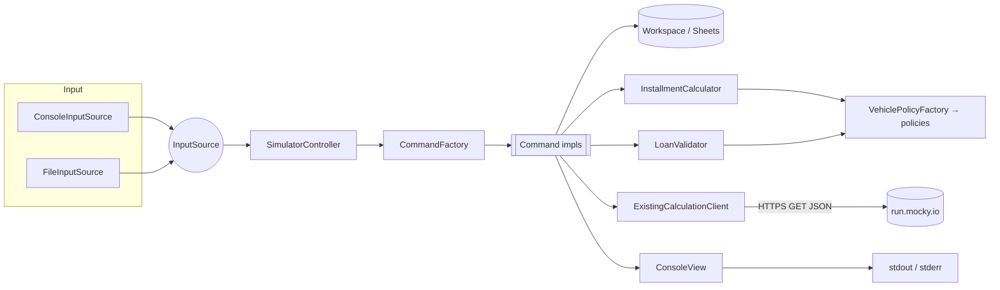
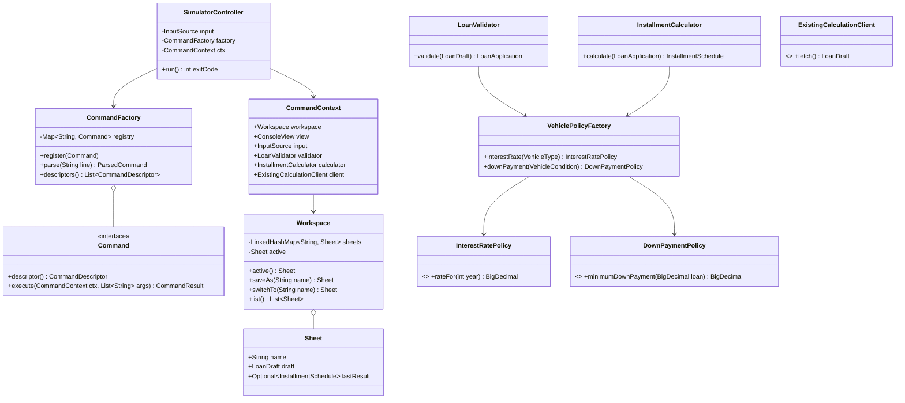
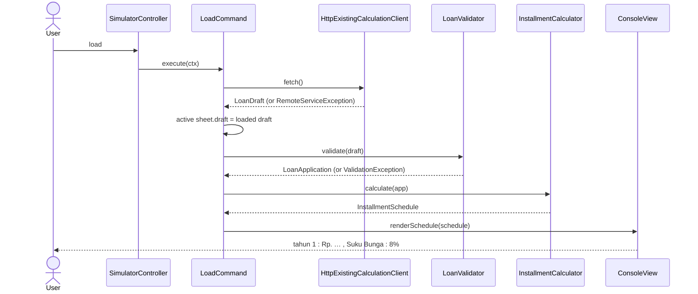
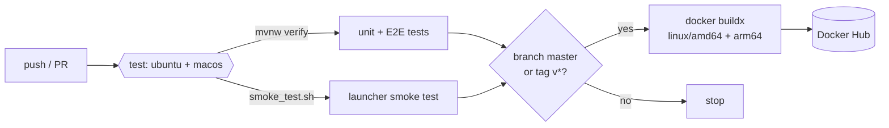

# Credit Simulator — Technical Design

| | |
|---|---|
| Author | Faris Dewantoro |
| Date | 2026-10-09 |
| Status | Implemented (see §14 for deviations found during implementation) |
| Language | Java 17 (Maven) |
| Source | `TechTest Backend.pdf`, `Rumus.xlsx`, reference jar `credit_simulator.jar` (commit `2320d2b`) |

> **Confidentiality.** The problem statement must not be made public. This document restates it, so it
> must only live in a **private** GitHub/GitLab repository (or be removed before the repo is made public).
> `TechTest Backend.pdf` must never be committed — it is added to `.gitignore`.

---

## 1. Summary

A console application, `credit_simulator`, that calculates the monthly installments of a vehicle loan
(car or motorcycle, new or used) year by year over a 1–6 year tenor. The user can enter the loan
parameters interactively or from a text file. They can also load an existing calculation from a JSON web
service, which is calculated and shown automatically.

The submission is judged mainly on object-oriented design, CI/CD and scripting, JSON/REST handling and
tests. The design therefore puts the most effort into a clear MVC + Command + Factory structure, a
pure and fully tested calculation core, and a reproducible build → test → Docker Hub pipeline.

The two "dynamic test" additions are first-class features:

1. **`show`** lists every available command (generated from the command registry, so it can't go stale).
2. **Sheets** — `save_sheet <name>` saves the current calculation under a name, `switch_sheet <name>`
   switches between saved calculations, and `list_sheets` lists them.

## 2. Requirements

### 2.1 Functional

| ID | Requirement |
|---|---|
| F1 | Input vehicle type: `Motor` \| `Mobil` (alphabetic, case-insensitive) |
| F2 | Input vehicle condition: `Bekas` \| `Baru` (alphabetic, case-insensitive) |
| F3 | Input vehicle year: numeric, 4 digits |
| F4 | Input total loan amount: numeric, ≤ 1,000,000,000 |
| F5 | Input tenor: 1–6 years |
| F6 | Input down payment (DP) amount |
| F7 | Output the monthly installment for each year of the tenor, with that year's interest rate |
| F8 | **Load**: GET the JSON web service, fill the inputs, and automatically calculate and display the result |
| F9 | Run as `./credit_simulator` or `bin/credit_simulator` (interactive) |
| F10 | Run as `./credit_simulator file_inputs.txt` or `bin/credit_simulator file_inputs.txt` (file input) |
| F11 | **`show`**: print all available commands |
| F12 | **Sheets**: save the current calculation as a named sheet and switch between sheets |

### 2.2 Business rules

| ID | Rule |
|---|---|
| R1 | A vehicle with condition `Baru` cannot have a year earlier than `currentYear - 1` |
| R2 | Tenor cannot be more than 6 years (and at least 1) |
| R3 | DP for a **new** vehicle ≥ 35% of the total loan amount |
| R4 | DP for a **used** vehicle ≥ 25% of the total loan amount |
| R5 | Base interest rate: Mobil 8%, Motor 9% |
| R6 | Interest rises year on year: +0.1% after odd years and +0.5% after even years (see §4.2) |
| R7 | Total loan amount ≤ 1,000,000,000 |

### 2.3 Non-functional and mandatory constraints

| ID | Constraint | How the design meets it |
|---|---|---|
| N1 | OO language, **no external libraries except one for web services** | JDK only at runtime, plus Jackson (JSON for the web service). JUnit 5 is test-scope only and never shipped |
| N2 | Builds and runs on Linux; reviewers use macOS and Linux | Plain Java 17 + POSIX `sh` launcher; CI runs on `ubuntu-latest` and `macos-latest` |
| N3 | Git with readable history, shipped as a tarball including `.git` | Small, focused commits following the plan in §12 |
| N4 | Executable `credit_simulator` at the repo root | POSIX shell launcher (§9.2) |
| N5 | README with step-by-step usage | `README.md` covers build, run (interactive/file/docker), test, CI |
| N6 | No class files, jars or build output checked in; standard build tool | Maven, `target/` ignored, Maven Wrapper in **script-only** mode (no `maven-wrapper.jar`) |
| N7 | Ship with GitHub/GitLab CI to Docker Hub | GitHub Actions workflow (§10) |
| N8 | Own unit tests, documented | JUnit 5 + end-to-end golden-file test + smoke script (§11) |
| N9 | Error handling | Typed exceptions, never a stack trace for user errors (§8) |
| N10 | Factory and MVC/MVP/MVVM patterns are a "huge plus" | MVC + Command + Factory + Strategy (§5) |

## 3. Assumptions and interpretations

The spec leaves some points open. These are the decisions made, each isolated so it is cheap to change.

| # | Ambiguity | Decision | Where it lives |
|---|---|---|---|
| A1 | What the DP is subtracted from | `principal = totalLoanAmount − downPayment`. This matches `Rumus.xlsx` ("Harga − DP = Pokok Pinjaman") and R3/R4, which express DP as a % of the loan amount | `LoanApplication#principal()` |
| A2 | How the rules "+0.1% every 1 year" and "+0.5% every 2 years" combine | They alternate, which is the only reading that reproduces the PDF sample (8% → 8.1% → 8.6%) and `Rumus.xlsx` (0.08, 0.081, 0.086). See §4.2 | `SteppedInterestRatePolicy` |
| A3 | What `currentYear` is | The system clock's year, via an injected `java.time.Clock` so tests are deterministic | `AppConfig`, validators |
| A4 | Year upper bound | The spec only says "4 digits". We also reject years after `currentYear + 1`, since a future model year beyond next year is almost certainly a typo. Reported as a validation error | `LoanValidator` |
| A5 | DP ≥ loan amount | Rejected: nothing would be left to finance. DP must be > 0 | `LoanValidator` |
| A6 | Number format of amounts | Plain digits only (`350000000`). `.` and `,` separators are rejected, because they are ambiguous between the Indonesian and US formats | `InputParser` |
| A7 | Output number format | Follows the PDF sample exactly: money `Rp. 3,500,000.00` (comma for thousands, dot for decimals), rate `8,1%` (comma for decimals, trailing zeros stripped) | `ConsoleFormatter` |
| A8 | Rounding | All arithmetic uses `BigDecimal` at full precision (`MathContext.DECIMAL128`); only the displayed value is rounded `HALF_UP` to 2 decimals. This reproduces the spreadsheet (e.g. `2,641,423.50`) | `InstallmentCalculator`, `ConsoleFormatter` |
| A9 | Do sheets survive a restart? | No. Sheets live in memory for one session, which keeps file-mode runs deterministic. Saving to disk is a listed extension (§13) | `Workspace` |
| A10 | `Monthly Rata2` cell in `Rumus.xlsx` (`SUM(yearly)/60`) | Treated as scratch work: it hardcodes 60 months for a 3-year example, and the spec's output is per-year. Not implemented | — |

## 4. Calculation specification

### 4.1 Algorithm (derived from `Rumus.xlsx`)

The loan is re-amortised every year: each year's interest is charged on the balance left over from the
previous year, and that total is spread over **all remaining months**.

```
balance₁ = totalLoanAmount − downPayment

for year y = 1..tenor:
    rate_y        = InterestRatePolicy.rateFor(vehicleType, y)
    total_y       = balance_y × (1 + rate_y)
    remainingMon  = 12 × (tenor − y + 1)
    monthly_y     = total_y / remainingMon
    paidThisYear  = monthly_y × 12
    balance_{y+1} = total_y − paidThisYear
```

Spreadsheet cells mapped to the algorithm: `D3` = balance₁, `D5:F5` = total_y, `D6:F6` = monthly_y,
`D7:F7` = paidThisYear, `E3:F3` = balance_{y+1}.

### 4.2 Interest rate schedule

The rate starts from the base and gets a step increase each year after the first. The step alternates:
+0.1 going into an even year (2, 4, 6) and +0.5 going into an odd year (3, 5).

| Year | Step | Mobil | Motor |
|---|---|---|---|
| 1 | — | 8.0% | 9.0% |
| 2 | +0.1 | 8.1% | 9.1% |
| 3 | +0.5 | 8.6% | 9.6% |
| 4 | +0.1 | 8.7% | 9.7% |
| 5 | +0.5 | 9.2% | 10.2% |
| 6 | +0.1 | 9.3% | 10.3% |

The rate depends only on vehicle type and year, not on the vehicle's condition (the spec gives no
condition-based rate).

### 4.3 Worked examples (these become unit-test fixtures)

**Example 1 — exactly reproduces `Rumus.xlsx`:** Mobil, Bekas (25% DP is only valid for used vehicles), loan 100,000,000, DP 25,000,000, tenor 3.

| Year | Rate | Total for year | Monthly |
|---|---|---|---|
| 1 | 8% | 81,000,000.00 | **2,250,000.00** |
| 2 | 8,1% | 58,374,000.00 | **2,432,250.00** |
| 3 | 8,6% | 31,697,082.00 | **2,641,423.50** |

**Example 2 — the web-service payload:** Mobil, Baru, 2025, loan 1,000,000,000, DP 500,000,000, tenor 6.

```
tahun 1 : Rp. 7,500,000.00/bln , Suku Bunga : 8%
tahun 2 : Rp. 8,107,500.00/bln , Suku Bunga : 8,1%
tahun 3 : Rp. 8,804,745.00/bln , Suku Bunga : 8,6%
tahun 4 : Rp. 9,570,757.82/bln , Suku Bunga : 8,7%
tahun 5 : Rp. 10,451,267.53/bln , Suku Bunga : 9,2%
tahun 6 : Rp. 11,423,235.41/bln , Suku Bunga : 9,3%
```

**Example 3 — single year, motorcycle:** Motor, Bekas, loan 20,000,000, DP 5,000,000, tenor 1
→ `tahun 1 : Rp. 1,362,500.00/bln , Suku Bunga : 9%`.

## 5. Architecture

### 5.1 Patterns and why

| Pattern | Applied to | Why |
|---|---|---|
| **MVC** | `Workspace`/domain (Model), `ConsoleView` (View), `SimulatorController` (Controller) | Calculation and validation have no I/O, so they can be tested without a console. The view can be swapped (e.g. for a REST layer later) |
| **Command** | One class per user command (`jenis`, `tahun`, `calculate`, `load`, `save_sheet`, …) | Adding a command means adding one class and one registration line. Each command is unit-testable. `show` is generated from the registry |
| **Factory** | `CommandFactory` (parses a line into a `Command`); `VehiclePolicyFactory` (returns the interest/DP policy for a type and condition) | Keeps "which implementation" decisions in one place instead of `if/else` chains spread through the code |
| **Strategy** | `InterestRatePolicy`, `DownPaymentPolicy` | Rate and DP rules vary by vehicle and may change. Each is a small replaceable object |
| **Dependency injection (manual)** | `CreditSimulatorApplication` wires everything | No framework is allowed. Constructor injection keeps the classes testable (e.g. inject a fixed `Clock` or a stub HTTP client) |

### 5.2 Component view



### 5.3 Package layout (Maven standard layout)

```
credit_simulator/
├── credit_simulator                  # root launcher (executable, POSIX sh)
├── bin/credit_simulator              # delegates to ../credit_simulator
├── mvnw, .mvn/wrapper/maven-wrapper.properties   # script-only wrapper, no jar
├── pom.xml
├── Dockerfile
├── .dockerignore, .gitignore
├── .github/workflows/ci.yml
├── scripts/smoke_test.sh
├── samples/file_inputs.txt
├── docs/TECH_DESIGN.md
├── README.md
└── src/
    ├── main/java/com/creditsimulator/
    │   ├── CreditSimulatorApplication.java       # main(): arg parsing, wiring, exit code
    │   ├── config/AppConfig.java                 # endpoint URL, timeouts, Clock
    │   ├── model/
    │   │   ├── VehicleType.java                  # enum MOBIL, MOTOR (+ case-insensitive parse)
    │   │   ├── VehicleCondition.java             # enum BARU, BEKAS
    │   │   ├── LoanDraft.java                    # mutable, nullable fields being edited
    │   │   ├── LoanApplication.java              # immutable, validated (record)
    │   │   ├── YearlyInstallment.java            # record(year, rate, total, monthly)
    │   │   ├── InstallmentSchedule.java          # list of YearlyInstallment
    │   │   ├── Sheet.java                        # name + LoanDraft + last schedule
    │   │   └── Workspace.java                    # sheets map + active sheet
    │   ├── policy/
    │   │   ├── InterestRatePolicy.java           # interface
    │   │   ├── SteppedInterestRatePolicy.java
    │   │   ├── DownPaymentPolicy.java            # interface
    │   │   ├── MinimumPercentageDownPaymentPolicy.java
    │   │   └── VehiclePolicyFactory.java
    │   ├── service/
    │   │   ├── LoanValidator.java
    │   │   ├── InstallmentCalculator.java
    │   │   ├── ExistingCalculationClient.java    # interface
    │   │   ├── HttpExistingCalculationClient.java
    │   │   └── dto/ExistingCalculationDto.java   # JSON shape of the web service
    │   ├── controller/
    │   │   ├── SimulatorController.java          # read → parse → execute loop
    │   │   ├── CommandContext.java               # what commands may touch
    │   │   └── command/
    │   │       ├── Command.java                  # interface
    │   │       ├── CommandFactory.java           # registry + parser
    │   │       ├── CommandDescriptor.java        # name, usage, description (for `show`)
    │   │       └── impl/ ShowCommand, SetVehicleTypeCommand, SetConditionCommand,
    │   │                  SetYearCommand, SetLoanAmountCommand, SetTenorCommand,
    │   │                  SetDownPaymentCommand, StatusCommand, CalculateCommand,
    │   │                  NewCalculationCommand, LoadCommand, SaveSheetCommand,
    │   │                  SwitchSheetCommand, ListSheetsCommand, ExitCommand
    │   ├── view/
    │   │   ├── ConsoleView.java                  # interface: info, error, schedule, status, table
    │   │   ├── PlainConsoleView.java
    │   │   └── ConsoleFormatter.java             # Rp./rate formatting (A7)
    │   ├── io/
    │   │   ├── InputSource.java                  # interface: Optional<InputLine> next(prompt)
    │   │   ├── ConsoleInputSource.java
    │   │   └── FileInputSource.java              # tracks line numbers for error messages
    │   └── exception/
    │       ├── CreditSimulatorException.java     # base, unchecked
    │       ├── ValidationException.java          # carries List<String> violations
    │       ├── InvalidInputException.java        # parse errors
    │       ├── UnknownCommandException.java
    │       ├── SheetNotFoundException.java
    │       └── RemoteServiceException.java
    └── test/java/com/creditsimulator/ ...        # mirrors main (§11)
```

### 5.4 Core class diagram



### 5.5 Key design choices

- **Two-phase validation: `LoanDraft` → `LoanApplication`.** The set commands (`tahun 2020`) only check
  the field itself (format, 4 digits, 1–6). That way the user can enter fields in any order and gets
  immediate feedback. Rules that span several fields (R1 year vs condition, R3/R4 DP vs loan and
  condition) run in `LoanValidator.validate()`, which returns an immutable `LoanApplication` or throws
  a `ValidationException` listing **every** violation, not just the first. `InstallmentCalculator`
  only accepts a `LoanApplication`, so it can never run on invalid data.
- **The calculator is pure.** No I/O and no clock, just `BigDecimal` in and out. That makes it trivial
  to test against the spreadsheet.
- **One `InputSource` abstraction for interactive and file modes.** The controller and the guided `new`
  flow don't know where lines come from. `FileInputSource` reports line numbers in error messages
  (`file_inputs.txt:7: tenor must be between 1 and 6`).
- **`show` is generated** from `CommandFactory.descriptors()`, so the help text can't drift from the
  commands that actually exist.

## 6. Command reference (user interface)

Commands are case-insensitive. Arguments are separated by whitespace. In file mode, blank lines and
lines starting with `#` are ignored.

| Command | Args | Effect |
|---|---|---|
| `show` | — | List all commands with usage and description (**F11**) |
| `new` | — | Guided flow: prompts for type → condition → year → loan → tenor → DP in order (the "flow" from the spec), then calculates automatically |
| `jenis` | `Mobil\|Motor` | Set vehicle type |
| `kondisi` | `Baru\|Bekas` | Set vehicle condition |
| `tahun` | `yyyy` | Set vehicle year |
| `nominal` | amount | Set total loan amount |
| `tenor` | `1..6` | Set tenor in years |
| `dp` | amount | Set down payment |
| `status` | — | Show the active sheet's inputs (unset fields marked `-`) and, if any, its last result |
| `calculate` | — | Validate and calculate; print the yearly schedule |
| `load` | — | Fetch the web-service JSON into the active sheet, validate, calculate and print (**F8**) |
| `save_sheet` | `name` | Save the active sheet's inputs and result under `name` and make it active (**F12**) |
| `switch_sheet` | `name` | Make `name` active and automatically display its status and result (**F12**) |
| `list_sheets` | — | List sheets; marks the active one and shows a short summary of each |
| `exit` | — | Quit |

The command names follow the reference jar (`show`, `jenis`, `kondisi`, `tahun`, `tenor`, `nominal`,
`status`, `calculate`, `load`), so existing users keep the same commands.

### 6.1 Sample session (also `samples/file_inputs.txt`)

```
# Example 1 (= Rumus.xlsx): used car, 25% DP
jenis mobil
kondisi bekas
tahun 2022
nominal 100000000
tenor 3
dp 25000000
calculate
save_sheet mobil-bekas

# Example 2: used motorcycle in a second sheet. save_sheet made 'mobil-bekas' active,
# so go back to the working sheet first or the edits below would change 'mobil-bekas'.
switch_sheet default
jenis motor
kondisi bekas
tahun 2019
nominal 20000000
tenor 1
dp 5000000
calculate
save_sheet motor-bekas

list_sheets
switch_sheet mobil-bekas
show
exit
```

## 7. Sheets (F12)

**Model.** `Workspace` holds an ordered `Map<String, Sheet>` plus a reference to the active sheet. At
startup there is one unnamed working sheet, `default`.

| Operation | Behaviour |
|---|---|
| Edit (`jenis`, `dp`, `load`, …) | Changes the **active** sheet in place. A sheet is a live workspace, like a spreadsheet tab |
| `save_sheet <name>` | "Save as": deep-copies the active sheet (draft and last result) to `<name>`, overwrites `<name>` if it exists (with a notice), and makes it active. Later edits go to `<name>`; the sheet copied from is unchanged |
| `switch_sheet <name>` | Makes `<name>` active and runs `status` automatically, showing its inputs and last calculation. An unknown name gives a `SheetNotFoundException` listing the available sheets |
| `list_sheets` | `* mobil-bekas  Mobil/Bekas/2022  Rp. 100,000,000  3 thn  ✔ calculated` |

**Name rules:** `[A-Za-z0-9_-]{1,32}`, matched case-insensitively and stored as typed.

**Result staleness:** any edit to a sheet's inputs clears that sheet's `lastResult`, so a sheet never
shows a result that doesn't match its inputs.

## 8. Error handling

| Situation | Exception | User-facing behaviour |
|---|---|---|
| Unknown command | `UnknownCommandException` | `Unknown command 'foo'. Type 'show' to list commands.` |
| Bad argument format (`tahun 20a6`, `jenis truk`) | `InvalidInputException` | Field-specific message, e.g. `Vehicle type must be Mobil or Motor` |
| Business rule broken on `calculate`/`load` | `ValidationException` | Every violation listed, e.g. `DP must be at least 35% of loan amount (min Rp. 35,000,000.00)` |
| `calculate` with missing fields | `ValidationException` | `Missing: tenor, dp` |
| Web service unreachable or times out | `RemoteServiceException` | `Could not reach calculation service (timeout after 10s)`; the sheet is left unchanged |
| Web service returns non-2xx | `RemoteServiceException` | `Calculation service returned HTTP 503` |
| Malformed or incomplete JSON | `RemoteServiceException` | `Calculation service returned an invalid payload: missing 'loanTenure'` |
| Loaded data breaks a rule (e.g. `Baru` + 2025 once it's 2027) | `ValidationException` | The data is loaded into the sheet but not calculated; the violations are shown so the user can fix them |
| Input file missing or unreadable | — (handled in `main`) | `Cannot read file 'x.txt': No such file`; exit code 2 |
| Unexpected bug | any `RuntimeException` | `Unexpected error: …` with the stack trace only when `CREDIT_SIMULATOR_DEBUG=1` |

**Policy:**
- Errors from a single command never end the session. The controller catches `CreditSimulatorException`
  per command, prints it to **stderr** through the view, and continues.
- **Exit codes:** `0` success; `1` file mode finished but at least one line failed (useful for CI); `2`
  usage error (bad arguments or unreadable file).
- In file mode every error is prefixed with `file:line`. In the guided `new` flow in file mode, an invalid
  answer aborts that flow so the following lines aren't misread as answers. Interactively, it re-prompts.
- At EOF without `exit` (in either mode), the app exits cleanly.

## 9. Integration and runtime

### 9.1 Web service client

- **Transport:** JDK `java.net.http.HttpClient` (no extra library). `GET` with `Accept: application/json`,
  5 s connect timeout, 10 s request timeout, follows redirects.
- **JSON:** Jackson `ObjectMapper` → `ExistingCalculationDto` (a Java record). Unknown properties are
  ignored, so new server fields don't break us. Missing required properties raise an error.
- **Mapping:** DTO → `LoanDraft` reuses the same parsers as the console commands (`"Mobil"` →
  `VehicleType.MOBIL`, case-insensitive). The loaded data then goes through exactly the same validation
  as typed input.
- **Configuration:** the URL defaults to `https://run.mocky.io/v3/9108b1da-beec-409e-ae14-e8091955666c`.
  It can be overridden with the env var `CREDIT_SIMULATOR_LOAD_URL`, because mocky URLs expire and tests
  point it at a local stub.
- **Contract:**

```json
{
  "vehicleType": "Mobil",
  "vehicleCondition": "Baru",
  "vehicleYear": 2025,
  "totalLoanAmount": 1000000000,
  "loanTenure": 6,
  "downPayment": 500000000
}
```



### 9.2 Launchers

`./credit_simulator` (POSIX `sh`, executable bit committed with `git update-index --chmod=+x`):

1. Resolves its own directory, so it works from any working directory and when symlinked.
2. Checks that `java` (≥ 17) is on `PATH` and prints a clear message if not.
3. If `target/credit-simulator.jar` is missing, or older than anything under `src/` or `pom.xml`, runs
   `./mvnw -q -B -DskipTests package`. The first run builds and later runs start instantly, so reviewers
   only need a JDK.
4. Runs `exec java -jar target/credit-simulator.jar "$@"`.

`bin/credit_simulator` is a three-line script that `exec`s the root launcher, so both invocation styles
in the spec work.

### 9.3 Build (Maven)

- `maven-compiler-plugin` with `<release>17</release>`.
- `maven-shade-plugin` builds a single runnable `target/credit-simulator.jar` (`Main-Class` in the
  manifest, Jackson bundled). This is build output and is never committed.
- `maven-surefire-plugin` runs JUnit 5.
- Dependencies: `com.fasterxml.jackson.core:jackson-databind` (compile scope) and
  `org.junit.jupiter:junit-jupiter` (test scope). Nothing else.
- `.gitignore`: `target/`, `*.class`, `*.jar`, `.DS_Store`, `.idea/`, `*.iml`, `TechTest Backend.pdf`.
  Also remove the existing `.DS_Store` from the index.

### 9.4 Docker

```dockerfile
# build stage
FROM maven:3.9-eclipse-temurin-17 AS build
WORKDIR /src
COPY pom.xml .
RUN mvn -B -q dependency:go-offline
COPY src ./src
RUN mvn -B -q -DskipTests package

# runtime stage
FROM eclipse-temurin:17-jre
RUN useradd --system --no-create-home app
WORKDIR /app
COPY --from=build /src/target/credit-simulator.jar /app/credit-simulator.jar
USER app
ENTRYPOINT ["java", "-jar", "/app/credit-simulator.jar"]
```

Usage:
`docker run -it <user>/credit-simulator` (interactive), or
`docker run --rm -v "$PWD/samples:/data:ro" <user>/credit-simulator /data/file_inputs.txt` (file mode).

## 10. CI/CD (GitHub Actions — `.github/workflows/ci.yml`)



| Job | Trigger | Steps |
|---|---|---|
| `test` | every push and PR | Matrix `ubuntu-latest`, `macos-latest`. `actions/setup-java` (temurin 17, Maven cache) → `./mvnw -B verify` → `scripts/smoke_test.sh` → upload surefire reports and the jar as artifacts |
| `docker` | `needs: test`; only on push to `master` or tags `v*` | `docker/setup-qemu-action` + `setup-buildx-action` → `docker/login-action` with secrets `DOCKERHUB_USERNAME` / `DOCKERHUB_TOKEN` → `docker/metadata-action` (tags `latest`, `sha-<short>`, semver from tag) → `docker/build-push-action` for `linux/amd64,linux/arm64` (arm64 so it runs natively on Apple Silicon reviewers) → run the pushed image against the sample file as a final check |

**Secrets:** a Docker Hub access token, never a password, stored as repo secrets. Nothing secret is in
the repo.

`scripts/smoke_test.sh`:
1. Runs `./credit_simulator samples/file_inputs.txt` and `bin/credit_simulator samples/file_inputs.txt`.
2. Asserts exit code 0 and greps for the expected lines (e.g. `tahun 1 : Rp. 2,250,000.00/bln`).
3. Runs with a missing file and asserts exit code 2.

This doubles as the reviewer's "does it work on my machine" check.

## 11. Test strategy

**Tooling:** JUnit 5 only. HTTP is tested against a real in-process server
(`com.sun.net.httpserver.HttpServer`, part of the JDK), so no mocking library is needed. Time is
controlled with `Clock.fixed(...)`.

| Test class | Covers |
|---|---|
| `SteppedInterestRatePolicyTest` | §4.2 table for both vehicle types, years 1–6; year 0 or 7 rejected |
| `InstallmentCalculatorTest` | §4.3 Examples 1–3 to the cent; tenor 1 edge case; the balance after the final year is ≈ 0 |
| `LoanValidatorTest` | Boundaries: new vehicle year = `currentYear−1` ✔ / `−2` ✘; tenor 0 ✘, 1 ✔, 6 ✔, 7 ✘; loan 1,000,000,000 ✔ / +1 ✘; new DP exactly 35% ✔ / 1 rupiah less ✘; used DP exactly 25% ✔ / less ✘; DP ≥ loan ✘; several violations reported together |
| `VehicleTypeTest`, `VehicleConditionTest` | `MOBIL`, `mobil`, ` Mobil ` ✔; `car`, empty, digits ✘ |
| `InputParserTest` | Amounts: digits ✔; `1.000`, `-5`, `1e9`, overflow ✘. Year: 4 digits only |
| `ConsoleFormatterTest` | `Rp. 3,500,000.00`; rates `8%`, `8,1%`, `10,2%` |
| `CommandFactoryTest` | Case-insensitive lookup; unknown command → exception; `show` lists every registered command |
| `WorkspaceTest` | save-as copies independently; switch to unknown name; overwrite notice; edits clear `lastResult` |
| `HttpExistingCalculationClientTest` | Stub server: 200 with valid JSON ✔; 500; malformed JSON; missing field; extra unknown field ✔; slow response → timeout |
| `LoadCommandTest` | Load → auto-calculate output; load with a rule violation → data set but not calculated |
| `CreditSimulatorApplicationE2ETest` | Runs `main` with `samples/file_inputs.txt` and a fixed clock, captures stdout, and compares with the golden file `src/test/resources/expected_output.txt`; checks the exit code |

**How to run** (documented in the README):
- `./mvnw test` runs unit + E2E tests.
- `./mvnw verify` is the same as CI.
- `scripts/smoke_test.sh` tests the launcher.
- `./mvnw test -Dtest=InstallmentCalculatorTest` runs a single class.

## 12. Implementation plan (doubles as the commit plan)

Each step is a commit (or a few), so the history shows how the solution evolved.

1. `chore`: Maven skeleton, script-only `mvnw`, `.gitignore`, remove `.DS_Store`
2. `feat(model)`: enums, `LoanDraft`, `LoanApplication`, and their parser tests
3. `feat(policy)`: interest-rate and DP policies, `VehiclePolicyFactory`, and tests
4. `feat(service)`: `InstallmentCalculator` with spreadsheet fixtures (test first)
5. `feat(service)`: `LoanValidator` with boundary tests
6. `feat(view)`: `ConsoleFormatter` and `PlainConsoleView`
7. `feat(controller)`: `Command`, `CommandFactory`, controller loop, set/status/calculate/show/exit
8. `feat(io)`: file input mode, line-numbered errors, exit codes, and the E2E golden test
9. `feat(load)`: HTTP client, DTO, `load` command, and stub-server tests
10. `feat(sheet)`: `Workspace`, `save_sheet`, `switch_sheet`, `list_sheets`
11. `feat(cli)`: guided `new` flow
12. `build`: root and `bin/` launchers, `smoke_test.sh`
13. `ci`: Dockerfile, GitHub Actions workflow, Docker Hub publish
14. `docs`: README (build, run, test, docker, CI, sample session)

## 13. Risks, open questions and future extensions

| Item | Notes |
|---|---|
| Rate rule interpretation (A2) | The highest-impact assumption. It is isolated in one class with a table-driven test, so a different reading is a one-class change. **Confirm with the reviewer if possible.** |
| The mocky sample becomes invalid in 2027 | `Baru` + 2025 breaks R1 from 2027. The app reports this correctly; the E2E test uses a fixed clock so it stays green |
| mocky.io URL expiry or outage | Configurable URL, clear error, and tests don't depend on the network |
| Problem statement confidentiality | Keep the repo private; never commit the PDF; this document restates the problem |
| Reviewer has no JDK 17 | The Docker image is the fallback, and the README lists both paths |
| Future: saving sheets to disk | `SheetRepository` interface (JSON file in `~/.credit_simulator/`). Kept out of scope by A9 |
| Future: REST API | The MVC split means a new controller/view can reuse `LoanValidator` and `InstallmentCalculator` as they are |

## 14. Implementation notes

Small deviations and clarifications found while implementing:

| Item | Note |
|---|---|
| §6.1 sample session | The original sample edited the motorcycle loan straight after `save_sheet mobil-bekas`. Because `save_sheet` makes the new sheet active (§7), that overwrote `mobil-bekas`. The sample now runs `switch_sheet default` first; §7's "save as" behaviour is unchanged |
| `InputSource` | Returns plain lines and exposes `lastLocation()` (e.g. `file_inputs.txt:7`) rather than an `InputLine` record, so errors raised while the `new` flow reads answers point at the answer's line |
| Commit order | `ConsoleFormatter` was committed before `LoanValidator`, whose messages format rupiah amounts. `Sheet`/`Workspace` were introduced with the controller (the commands need an active sheet) and extended with save/switch/list in the sheet step |
| Launcher | Also rejects a `java` that exists but does not run (the macOS `/usr/bin/java` stub without a JDK). Rebuild is triggered by changes to `pom.xml` or `src/main`, not tests |
| Field-level vs rule checks | `nominal` only checks the format; the 1,000,000,000 cap is enforced by `LoanValidator`, so loaded data that breaks it is kept in the sheet and reported (§8) |
